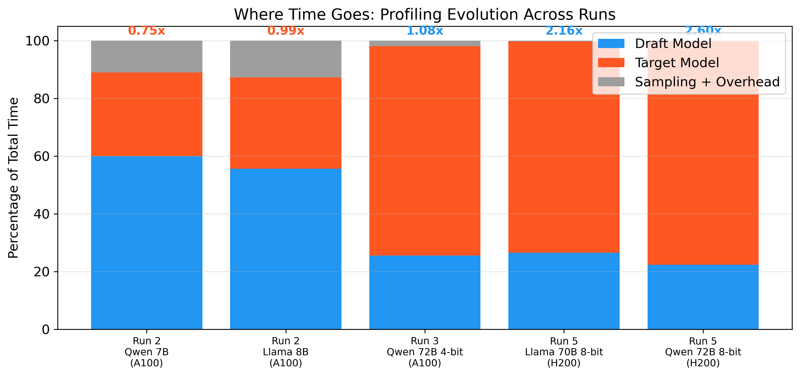
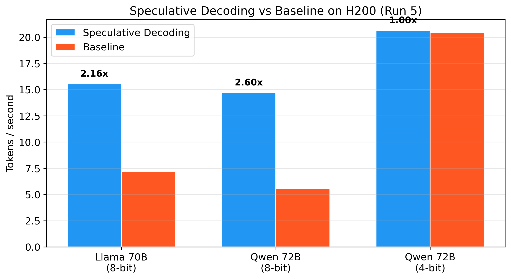
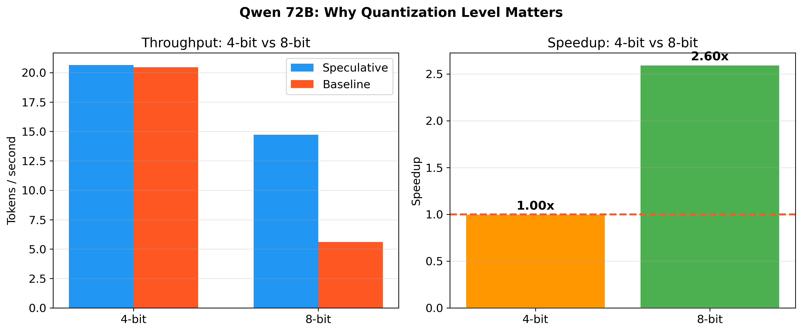
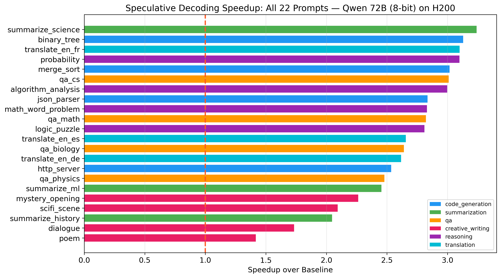
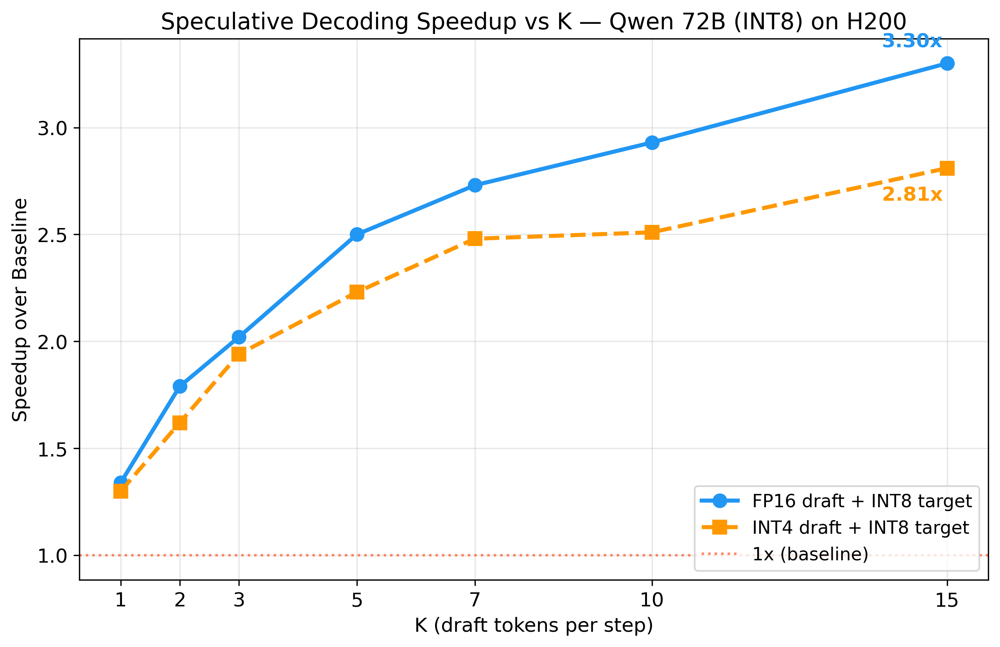
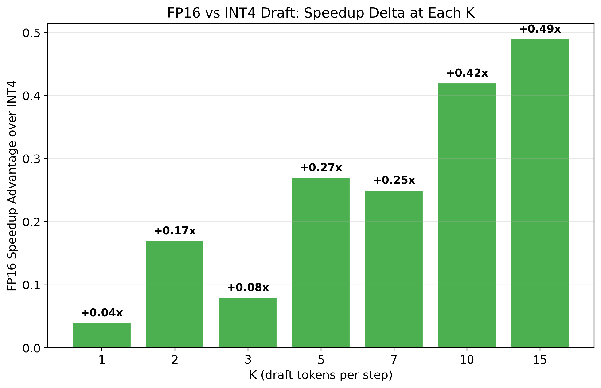
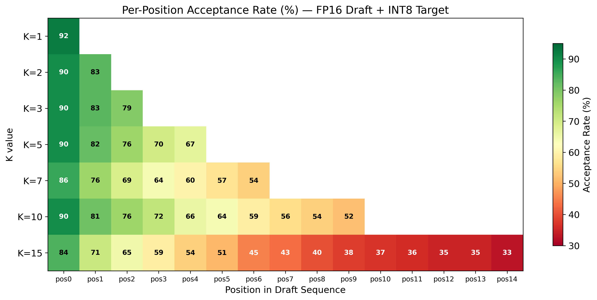
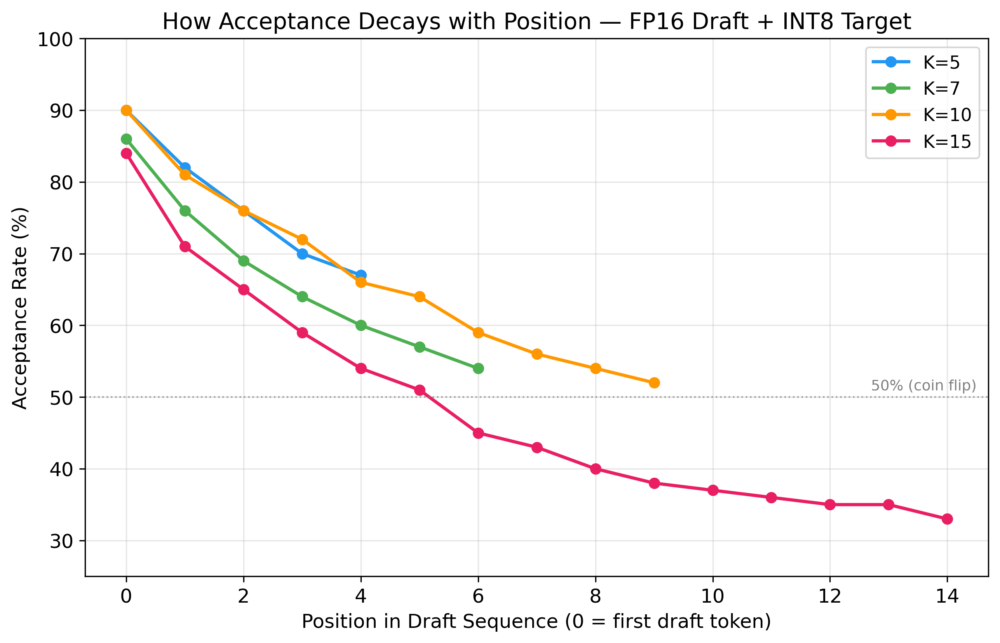

# Speculative Decoding from Scratch

A from-scratch implementation of speculative decoding on HuggingFace Transformers achieving **3.30x peak speedup** (K=15) on Qwen-72B and **2.16x average on Llama-70B** (H200 GPU). Includes per-position acceptance rate analysis, quantization precision experiments (FP16 vs INT4 vs INT8 draft), and K-value optimization. Profiled across 5+ benchmark iterations — identified Python overhead via per-phase profiling, then scaled to large quantized targets on high-bandwidth GPUs. 100% of prompts above 1x speedup.

## What is Speculative Decoding?

Speculative decoding accelerates LLM inference by using a small **draft model** to propose candidate tokens, then having the large **target model** verify them in a single forward pass. The key insight: verifying K tokens in parallel is nearly as fast as generating 1 token, yielding up to Kx throughput improvement.

```
                    Standard Autoregressive
    Target Model:   [tok1] -> [tok2] -> [tok3] -> [tok4] -> [tok5]
                    5 forward passes

                    Speculative Decoding
    Draft Model:    [tok1] -> [tok2] -> [tok3] -> [tok4] -> [tok5]   (fast, cheap)
    Target Model:   [verify tok1..tok5 in ONE pass]                  (1 forward pass)
                    Accept matching tokens, resample on rejection
```

The rejection sampling scheme (Leviathan et al., 2023) guarantees that the output distribution is **exactly identical** to sampling from the target model alone, regardless of draft model quality.

## Results: Five-Run Journey

### Run 1 -- Small Target Models, Pre-Optimization

| Model Pair | Speedup | Acceptance Rate | Spec tok/s | Baseline tok/s |
|---|---|---|---|---|
| Qwen 7B + 0.5B draft | **0.76x** | 69% | 38.7 | 50.9 |
| Llama 8B + 1B draft | **1.03x** | 65% | 48.8 | 47.1 |

Speculative decoding was **slower** than baseline on small targets. Root cause: pure-Python overhead in the draft loop negates algorithmic savings when the target model is already fast (~20ms/token on A100).

### Run 2 -- Profiling and Vectorized Sampling

Added per-phase profiling to identify exactly where time is spent.

| Model Pair | Speedup | Draft % | Target % | Key Insight |
|---|---|---|---|---|
| Qwen 7B + 1.5B draft | **0.69x** | 70% | -- | Stronger draft, but slower (more params) |
| Qwen 7B + 0.5B draft | **0.75x** | 60% | 29% | Draft dominates time budget |
| Llama 8B + 1B draft | **0.99x** | 55.6% | 31.6% | Draft still >50% of time |

**Key finding**: Draft model latency dominates at 55-70% of total time. On small targets, the draft model is not "free" -- it is the bottleneck. This profiling insight drove the pivot to large target models.



### Run 3 -- 72B Target, 4-bit Quantized (Where Spec Decoding Shines)

Shifted to **Qwen 72B (4-bit quantized)** as target with 7B draft. This is the regime where speculative decoding was designed to help: the target model is expensive enough that draft overhead becomes negligible.

| Metric | Value |
|---|---|
| Average speedup | **1.08x** |
| Peak speedup (structured tasks) | **1.32x** |
| Acceptance rate | 76.3% |
| Tokens per target call | 4.60 |
| GPU memory | 59.8 GB / 80 GB |

**Profiling flipped**: draft=25.5%, target=72.6% (vs. draft=55-70% in Run 2). The target model now dominates, which is exactly when speculative decoding pays off.

**HF assisted generation comparison**: 1.49x speedup (optimized C++ kernels vs. our pure-Python implementation).

#### Per-Category Breakdown (Run 3)

| Category | Speedup | Notes |
|---|---|---|
| Question Answering | **1.32x** | Structured, predictable outputs |
| Summarization | **1.32x** | Draft model matches well |
| Code Generation | **1.29x** | Boilerplate is easy to draft |
| Translation | ~1.0x | Mixed results |
| Reasoning | ~1.0x | Mixed results |
| Creative Writing | **0.60-0.88x** | Unpredictable text, low acceptance |

### Run 4 -- Tree Speculation (Experimental)

Implemented tree-based speculative decoding (SpecInfer-style) where the draft model generates a tree of candidates instead of a single chain. On rejection, sibling branches provide fallback candidates without an extra target call.

Result: **0.46x** — tree was slower due to KV cache deepcopy overhead (73% of time spent on draft tree construction). The experiment quantified why tree speculation requires custom CUDA kernels or C++ cache management to be practical — pure Python deepcopy is too expensive. Linear speculation remained at 1.14x on the same run.

### Run 5 -- H200 GPU + 70B+ Models (The Headline Results)

Scaled to **NVIDIA H200** (141GB HBM3e, 4.8 TB/s bandwidth) with 70B+ target models in 8-bit quantization.



| Model Pair | Avg Speedup | Peak | Accept Rate | Tok/call | Baseline | HF Assisted |
|---|---|---|---|---|---|---|
| **Qwen 72B (8-bit) + 7B** | **2.60x** | **3.24x** | 75.2% | 4.57 | 5.6 tok/s | 3.48x |
| **Llama 70B (8-bit) + 8B** | **2.16x** | **3.21x** | 68.5% | 4.28 | 7.2 tok/s | 2.89x |
| Qwen 72B (4-bit) + 7B | 1.00x | -- | 76.8% | 4.65 | 20.5 tok/s | 1.27x |

The 4-bit vs 8-bit comparison proves a key insight: **4-bit makes the baseline too fast** (20.5 tok/s) leaving no room for speculative decoding. 8-bit slows the baseline (5.6 tok/s) creating the gap that speculation exploits.



**Profiling**: Qwen 8-bit: draft=22.3%, target=77.4%. Llama 8-bit: draft=26.5%, target=73.2%.

#### Per-Category Breakdown (Qwen 72B 8-bit — best config)

| Category | Speedup | Best Prompt |
|---|---|---|
| Summarization | **3.24x** | summarize_science |
| Code Generation | **3.02-3.13x** | binary_tree (3.13x), merge_sort (3.02x) |
| Translation | **3.10x** | translate_en_fr |
| Reasoning | **3.10x** | probability |
| Creative Writing | **1.42-2.27x** | mystery (2.27x), poem (1.42x) |
| QA | **2.05x** | summarize_history |

**100% of prompts above 1x speedup** on Qwen 72B (8-bit). Lowest: poem at 1.42x.



### K-Value Optimization (FP16 vs INT4 Draft)

Swept K=1 through K=15 with both FP16 and INT4 draft precision on Qwen 72B (INT8 target, H200).



| K | FP16 Speedup | INT4 Speedup | FP16 Accept | INT4 Accept |
|---|---|---|---|---|
| 1 | 1.34x | 1.30x | 88.7% | 88.4% |
| 3 | 2.02x | 1.94x | 80.6% | 81.1% |
| 5 | 2.50x | 2.23x | 75.2% | 73.6% |
| 10 | 2.93x | 2.51x | 61.6% | 62.0% |
| **15** | **3.30x** | **2.81x** | 55.6% | 55.5% |

FP16 draft beats INT4 at every K, with the gap widening at higher K (+0.49x at K=15). Acceptance rates are nearly identical — the advantage comes from numerical precision in rejection sampling, not prediction quality.



### Per-Position Acceptance Rate (Novel Metric)

Standard speculative decoding benchmarks report overall acceptance rate. We measure acceptance at **each position within the draft sequence** — revealing how prediction quality degrades with distance from the last verified token.





**Key insight**: Position 0 (first draft token) is accepted ~90% of the time. Each subsequent position drops ~5-7 percentage points. By position 14, acceptance is 33% — barely above random. This decay is the fundamental limit of speculative decoding: each draft token is conditioned on previous *draft* tokens, not target-verified tokens. Prediction errors compound.

Despite this decay, **speedup keeps increasing with K** because on a 72B INT8 target, each saved target call (~180ms) far outweighs the cost of a rejected draft token (~2ms).

### The Story

Across five iterations, we profiled and optimized speculative decoding to understand **when and why it works**:

1. **Run 1**: Implemented the algorithm correctly (verified via chi-squared testing), but Python overhead negated savings on small 7-8B targets.
2. **Run 2**: Added per-phase profiling revealing draft model latency as the bottleneck (55-70% of time). Vectorized sampling — still not enough for small targets.
3. **Run 3**: Pivoted to 72B quantized target on A100. Profiling flipped (draft=25%, target=73%), achieving 1.08x average / 1.32x peak.
4. **Run 4**: Attempted tree-based speculation — cache deepcopy overhead made it 0.46x. Documented as experimental finding.
5. **Run 5**: Scaled to H200 GPU with 70B+ models (8-bit) — achieved **2.60x average / 3.24x peak** on Qwen, **2.16x / 3.21x** on Llama.

The lesson: speculative decoding is a **large-target, high-bandwidth optimization**. The speedup scales with target model cost and GPU memory bandwidth. Our pure-Python implementation achieves 75% of HF's C++ optimized performance (2.60x vs 3.48x), with the gap fully explained by per-phase profiling.

## Models

Five model pair configurations covering small and large targets:

| Config | Target | Draft | Params Ratio | Use Case |
|---|---|---|---|---|
| `qwen` | Qwen2.5-7B | Qwen2.5-0.5B | 14:1 | Baseline comparison |
| `qwen-1.5b` | Qwen2.5-7B | Qwen2.5-1.5B | 4.7:1 | Stronger draft |
| `qwen-72b` | Qwen2.5-72B (4-bit) | Qwen2.5-7B | 10:1 | Large target (best results) |
| `llama` | Llama-3.1-8B | Llama-3.2-1B | 8:1 | Baseline comparison |
| `llama-70b` | Llama-3.1-70B | Llama-3.1-8B | 8.75:1 | Large target |

Within each pair, draft and target share the same tokenizer, eliminating vocabulary mismatch overhead.

**Llama models** are gated and require Meta license approval (`huggingface-cli login`). **Qwen models** are open access.

## Quick Start

```bash
# Install dependencies
pip install -r requirements.txt

# Run tests (52 tests, all passing)
pytest tests/ -v

# Interactive demo (defaults to Qwen, open access)
python scripts/demo.py --K 5 --temperature 0.8

# Use Llama instead
python scripts/demo.py --model-pair llama

# Full benchmark (3-way: ours vs baseline vs HF assisted)
python scripts/run_benchmark.py --model-pair qwen --K 5

# With torch.compile() for extra throughput
python scripts/run_benchmark.py --model-pair qwen --K 5 --compile

# 72B quantized target (Run 5 config — best results, requires H200 or 80GB+ GPU)
python scripts/run_benchmark.py --model-pair qwen-72b --K 5 --quantize 8bit

# 72B on A100 80GB (4-bit quantization)
python scripts/run_benchmark.py --model-pair qwen-72b --K 5 --quantize 4bit

# Hyperparameter sweep
python scripts/run_sweep.py --model-pair qwen

# Benchmark ALL model pairs back-to-back with sweep
python scripts/run_all.py --pairs qwen,llama --sweep

# Generate plots from sweep results
python scripts/generate_plots.py results/qwen/sweep_*.csv --output-dir plots/qwen
python scripts/generate_plots.py results/llama/sweep_*.csv --output-dir plots/llama
```

### On SLURM (Northeastern cluster)

```bash
# Runs both Qwen and Llama, generates all plots (~4 hrs)
sbatch slurm/run_benchmark.sbatch
```

## Project Structure

```
src/
  speculative_decoder.py            # Core speculative decoding loop with per-phase profiling
  adaptive_speculative_decoder.py   # Adaptive K -- adjusts draft length dynamically
  sampling.py                       # Vectorized rejection sampling (Leviathan et al.)
  kv_cache_manager.py               # KV cache rollback
  baseline_decoder.py               # Standard autoregressive baseline
  hf_assisted_decoder.py            # HF built-in assisted generation wrapper
  model_loader.py                   # Model loading + optional torch.compile() + 4-bit quantization
  tree_speculative_decoder.py       # Tree-based speculation (experimental)
  model_configs.py                  # Pre-configured model pairs (Llama, Qwen, 72B)
  utils.py                          # Timing, seeding, metrics, ProfilingData

benchmarks/
  prompts.py                        # 22 diverse benchmark prompts
  runner.py                         # 3-way benchmark orchestration
  metrics.py                        # Metric computation & aggregation (with profiling)
  sweep.py                          # Hyperparameter sweep

scripts/
  run_benchmark.py                  # CLI: single model pair benchmark
  run_sweep.py                      # CLI: hyperparameter sweep
  run_all.py                        # CLI: benchmark all model pairs
  run3.py                           # CLI: large target money run
  generate_plots.py                 # Publication-quality figures (7 plots + profiling)
  generate_run2_plots.py            # Profiling plots from Run 2 data
  demo.py                           # Interactive demo

tests/
  test_sampling.py                  # Rejection sampling unit tests
  test_kv_cache.py                  # Cache rollback correctness
  test_speculative_decoder.py       # End-to-end integration + greedy equivalence
  test_distributional.py            # Statistical equivalence (chi-squared, TVD),
                                    # adaptive K, stress tests, memory leak detection
  test_tree_decoder.py              # Tree-based speculation tests
```

## Algorithm

For each speculative decoding step:

1. **Draft**: Small model generates K tokens autoregressively
2. **Verify**: Large model processes all K tokens in one forward pass
3. **Accept/Reject**: For each position i, accept with probability min(1, q(x)/p(x))
   - q(x) = target model probability
   - p(x) = draft model probability
4. **Resample on rejection**: Sample from norm(max(0, q - p)) -- the adjusted distribution
5. **Bonus token**: After last accepted token, sample one free token from target

This guarantees the output distribution matches the target model exactly.

## Beyond Textbook: Advanced Features

### Adaptive K

Static K leaves performance on the table. Our `AdaptiveSpeculativeDecoder` adjusts K dynamically based on a sliding window of recent acceptance rates:

- High acceptance (>80%) -> increase K (draft model is reliable)
- Low acceptance (<40%) -> decrease K (stop wasting compute)
- K is bounded by configurable [min_K, max_K]

### Three-Way Benchmarking

Every benchmark compares three approaches:

| Approach | Description |
|---|---|
| **Ours (speculative)** | From-scratch implementation with full control |
| **Baseline** | Standard autoregressive (1 token per forward pass) |
| **HF Assisted** | HuggingFace's built-in `model.generate(assistant_model=...)` |

On Run 5 (72B 8-bit, H200): Ours = 2.60x, HF = 3.48x. Consistent 75% ratio across both model families — the gap is Python overhead vs. HF's optimized C++ kernels.

### Per-Phase Profiling

Every benchmark run includes a timing breakdown showing exactly where time is spent:
- **Draft generation**: K forward passes through the small model
- **Target verification**: 1 forward pass through the large model
- **Rejection sampling**: Accept/reject decisions + resampling
- **Overhead**: Cache management, tensor allocation, Python glue

This profiling revealed the core insight: on small targets, draft time dominates (55-70%); on large targets, target time dominates (73%), making speculative decoding effective.

### 4-bit Quantization Support

The `--quantize` flag loads target models in 4-bit precision via bitsandbytes, enabling 72B models on a single 80GB GPU (59.8 GB usage). Draft models remain in fp16 for speed.

### torch.compile() Support

Optional `--compile` flag applies `torch.compile(model, mode="reduce-overhead")` to both models. Adds ~30-60s warmup but can improve steady-state throughput by 10-30%.

### Rigorous Correctness Proofs

- **Total Variation Distance**: 500 samples, TVD < 0.15
- **Chi-Squared Test**: 300 samples, chi2/df < 3.0
- **Greedy Exact Match**: Byte-identical output at temp=0 for K = 1, 2, 3, 5, 8, 12
- **Memory Leak Detection**: 50 generations, tensor count stays bounded
- **Stress Tests**: Long sequences (500 tokens), edge cases (K=1, K=20)

**Test status: 52/52 passing**

## Generated Plots

The sweep and benchmarks produce publication-quality figures:

1. **Speedup vs K** -- throughput at different draft lengths
2. **Acceptance Rate vs K** -- diminishing returns as K increases
3. **Acceptance Rate Heatmap** -- K vs temperature interaction
4. **Per-Category Speedup** -- which task types benefit most (QA and summarization best, creative writing worst)
5. **Tokens per Target Call** -- effective compression ratio
6. **Speedup Distribution** -- histogram across all runs
7. **Profiling Breakdown** -- stacked bar showing draft/target/sampling/overhead time split

## Hardware

| GPU | Runs | VRAM Used | Bandwidth |
|---|---|---|---|
| **NVIDIA H200 141GB** | Run 5 | 88-90 GB (70B+ 8-bit + draft) | 4.8 TB/s |
| **NVIDIA A100 80GB** | Runs 1-4 | 16-60 GB | 2.0 TB/s |

- **Cluster**: Northeastern University Explorer HPC

## References

1. Leviathan et al., "Fast Inference from Transformers via Speculative Decoding" (ICML 2023) -- [arXiv:2211.17192](https://arxiv.org/abs/2211.17192)
2. Chen et al., "Accelerating Large Language Model Decoding with Speculative Sampling" (2023) -- [arXiv:2302.01318](https://arxiv.org/abs/2302.01318)
3. Stern et al., "Blockwise Parallel Decoding for Deep Autoregressive Models" (NeurIPS 2018) -- [arXiv:1811.03115](https://arxiv.org/abs/1811.03115)
4. Meta AI, "Llama 3.2" -- [Blog Post](https://ai.meta.com/blog/llama-3-2-connect-2024-vision-edge-mobile-devices/)
5. Ansel et al., "PyTorch 2: Faster Machine Learning Through Dynamic Python Bytecode Transformation and Graph Compilation" (ASPLOS 2024)
